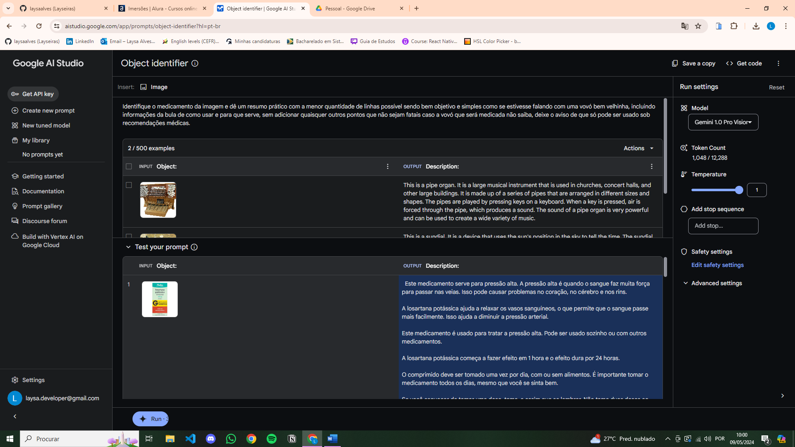
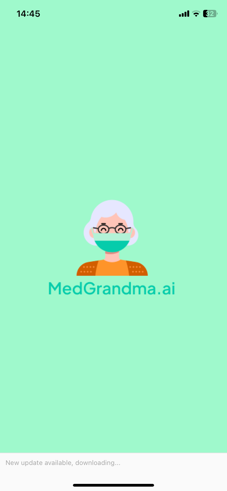
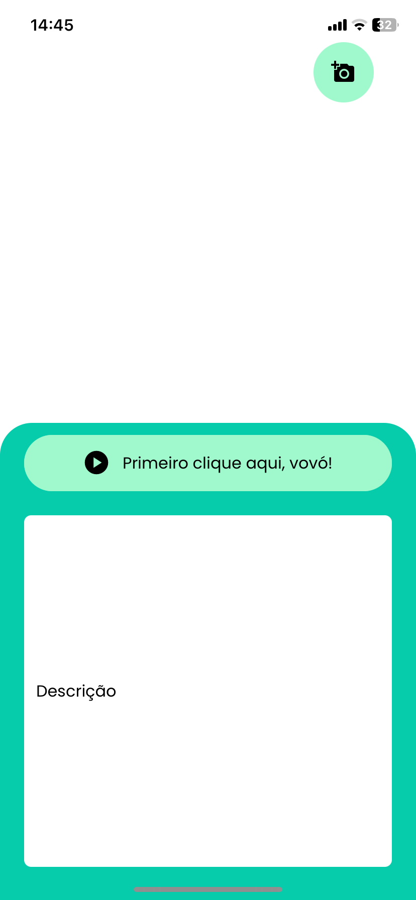
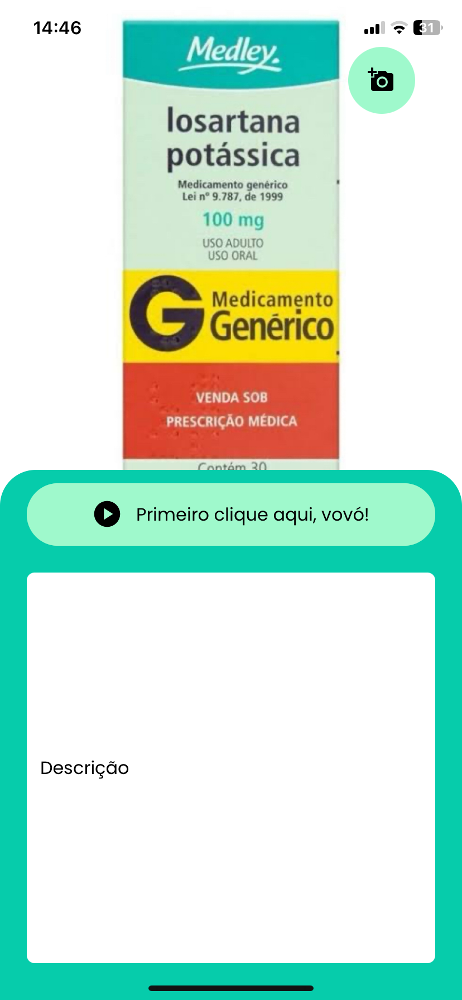
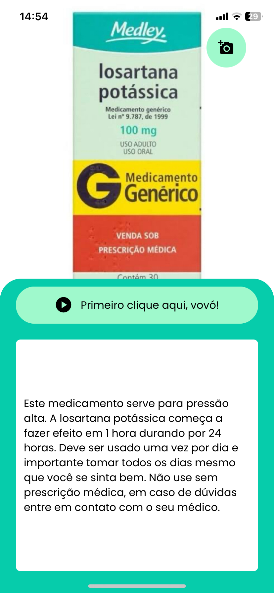

<p align="center">
  <a href="#introdução">Introdução</a>&nbsp;&nbsp;&nbsp;|&nbsp;&nbsp;&nbsp;
  <a href="#tecnologias">Tecnologias</a>&nbsp;&nbsp;&nbsp;|&nbsp;&nbsp;&nbsp;
  <a href="#aperte-o-play">Acesse o app</a>&nbsp;&nbsp;&nbsp;|&nbsp;&nbsp;&nbsp;
  <a href="#licença">Licença</a>&nbsp;&nbsp;&nbsp;
</p>

<p align="center">
   
<p>
<p>Primeiro eu fui no Google AI Studio e pedi a descrição de 3 imagens assim como foi feito durante a imersão, pelo Fabrício Carraro! Depois peguei o código JavaScript do Prompt, estudei a lógica dentro do Google Colab (ótimo para fazer testes com a API Key, inclusive!) e fui desenvolver com React Native. A interface principal está assim no momento:</p>
<p align="center">
  
  
  
  
<p>

---
## Introdução

Me inspirei na minha vida pessoal para criar esse projeto, com base em acontecimentos recentes, onde me vi em meio aos problemas relacionados à minha avó que usa muitos remédios por conta da diabétes, ossos etc...Então tive a ideia de criar esse aplicativo, implementar a Gemini AI, a Inteligência Artificial da Google, possibilitando identificar o conteúdo da imagem (foto da caixa do remédio) e descrever sobre o uso, dar recomendações etc. Deixando mais prático e simples no dia a dia! Contei um pouco da minha história de vida lá na aba de "Apresente-se" no Discord e é ela que me faz continuar motivada e enfrentar desafios como esse, buscando aproveitar ao máximo todo esse conhecimento de programação gratuito na Alura e evoluir a cada linha de código escrita.

- Status do projeto:
- [x] Interface principal;
- [x] Funcionalidade de selecionar imagens da galeria;
- [x] Gerar a descrição da imagem com a AI;
- [x] Funcionalidade de dar play no aúdio de instruções.
---
## Tecnologias

-  [Google AI Studio](https://aistudio.google.com/) com a API Key, para gerar descrições de imagem;
-  [Node.js](https://nodejs.org/en/docs/) para consumir a API;
-  [React Native](http://facebook.github.io/react-native/) com o [Expo](https://expo.io/);
-  [Axios](https://github.com/axios/axios) para a comunicação com a API;
-  [TypeScript](https://www.typescriptlang.org/) para tipagem dos dados.

## Documentação e pesquisa

- [Gemini API](https://ai.google.dev/gemini-api/docs/get-started/rest?hl=pt-br) para entender como aplicar no projeto;
- [GitHub do Google Gemini](https://github.com/google-gemini/generative-ai-js) para escrever o código de teste no Google Colab usando JavaScript.

---
## Aperte o play

### Pré-requisitos

  - Você deve ter o **[Node.js](https://nodejs.org/en/)** instalado na sua máquina;
  - Você deve ter o **[Git](https://git-scm.com/)** instalado e configurado no seu computador;
  - Além disso, você **precisa** de um gerenciador de pacotes, eu usei o **[NPM](https://www.npmjs.com/)**;
  - Por fim, você precisa ter **[Expo](https://expo.io/)** para emular o aplicativo.

### Instalação

1. Faça o clone do repositório:

```bash
  $ git clone (https://github.com/laysaalves/medgrandma-ai.git)
```

2. Inicie o app:

```bash
  # Vá até o app
  $ cd medgrandma-ai
  # Instale as dependências do projeto
  $ npm install
  # Inicie o app
  $ npx expo start
```
## Licença

Este projeto está sob a licença MIT. Consulte o [LICENSE](LICENSE.md) para obter mais detalhes.

---
[Voltar ao topo](#introdução)<br>
